> ⚠️ **Disclaimer:** This project is a Proof of Concept (PoC) designed strictly for educational purposes and cybersecurity research. Do not execute this code on any system or network without explicit permission.

# Phase 1: Threat Simulation & Exploitation (Red Team)

## Overview
The first phase of this Proof of Concept demonstrates how a typical ransomware payload operates on an infected endpoint. The custom Python script (`attacker.py`) utilizes the `cryptography` library (implementing Fernet, which is built on top of AES in CBC mode with a 128-bit key) to systematically render files inaccessible.

## Step 1: Environment Preparation
To safely simulate the attack without risking actual system integrity, a dedicated directory containing 100 dummy files was generated within the isolated Ubuntu Virtual Machine. 

A simple bash loop was used to rapidly provision the target directory with files containing realistic string data:

```bash
mkdir ~/WICHTIGE_FIRMEN_DATEN
cd ~/WICHTIGE_FIRMEN_DATEN
for i in {1..100}; do echo "Dies ist ein extrem wichtiges Firmendokument Nummer $i. Enthält geheime Finanzdaten." > "geheime_rechnung_$i.txt"; done
```

<p align="center">
  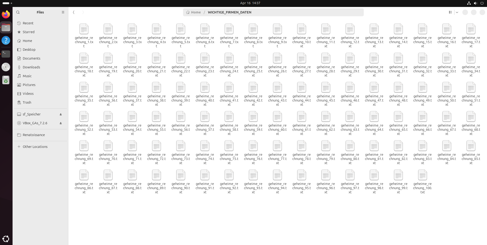
  <br><i>The target directory after successfully provisioning 100 dummy files.</i>
</p>

## Step 2: Payload Execution
Upon execution, `attacker.py` performs the following automated steps:
1. **Key Generation:** Generates a unique cryptographic key (`secret.key`) and saves it locally. In a real-world scenario, this key would be exfiltrated to an external Command and Control (C2) server.
2. **File Iteration:** Iterates through the predefined target directory.
3. **Encryption & Renaming:** Reads the binary data of each file, encrypts it using the AES-based Fernet scheme, overwrites the original data, and appends the `.locked` extension.

<p align="center">
  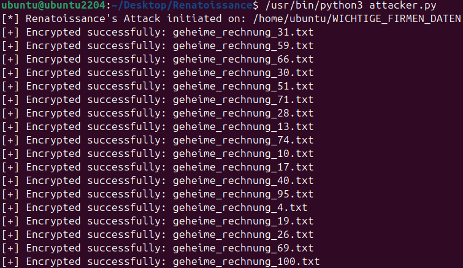
  <br><i>Execution of the attacker.py script targeting the dummy directory.</i>
</p>

<p align="center">
  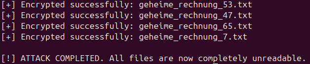
  <br><i>Terminal output confirming the successful encryption of all 100 files.</i>
</p>

After the script finishes, the unique decryption key is left in the working directory, simulating the asset an attacker would hold for ransom.

<p align="center">
  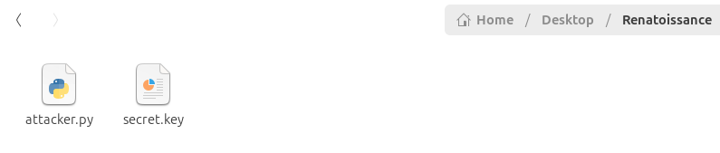
</p>

## Step 3: The Aftermath
Once the encryption process concludes, the target directory is completely compromised. All original files are inaccessible, their file extensions have been altered to `.locked`, and the system drops a standard ransom note (`READ_ME_NOW.txt`) to demand payment.

<p align="center">
  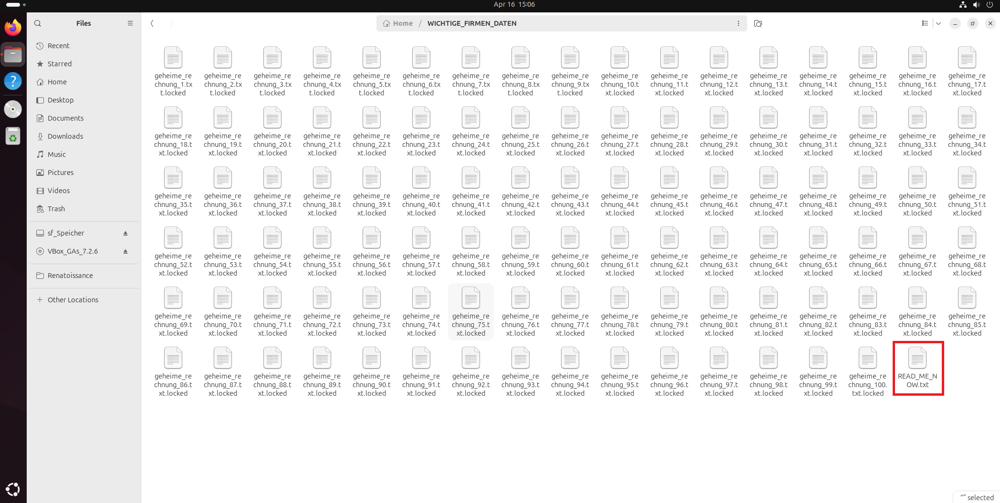
  <br><i>The compromised directory showing modified extensions and the dropped ransom note.</i>
</p>

Attempting to read the contents of the encrypted files reveals completely obfuscated ciphertext, verifying the success of the AES encryption layer.

<p align="center">
  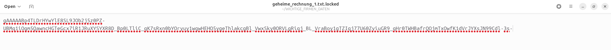
  <br><i>Viewing the unreadable AES ciphertext of an encrypted dummy document.</i>
</p>

The ransom note instructs the user on how to theoretically recover their data.

<p align="center">
  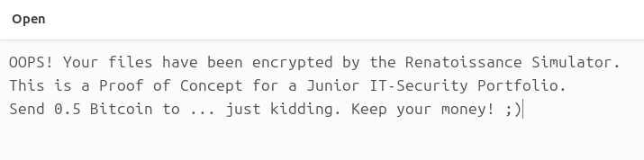
</p>

## Real-World EDR/AV Detection Note
It is worth noting that while working on this code in a shared host-to-VM folder, Microsoft Defender on the host operating system immediately flagged the custom script as malicious.

<p align="center">
  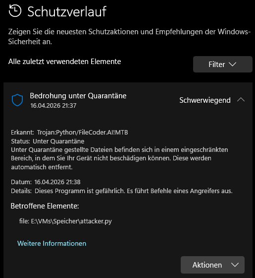
  <br><i>Microsoft Defender intercepting the custom payload via behavioral heuristics.</i>
</p>

The heuristic engine classified the script as `Trojan:Python/FileCoder.AI!MTB`, highlighting that the programmed behavior (rapid file iteration, cryptography imports, file extension modification) perfectly mirrors actual threat actor tooling.

---

# Phase 2: Incident Response & Recovery (Blue Team)

## Overview
Once the threat has been identified and the cryptographic key has been secured, the incident response (IR) phase begins. This stage focuses on data recovery and system restoration. For this PoC, a dedicated recovery tool (`decrypter.py`) was developed to reverse the encryption and restore the organization's critical data.

## Step 1: Key Acquisition
In a real-world scenario, the decryption key is either provided after a ransom payment (not recommended) or recovered through forensic analysis of the attacker's infrastructure. In our simulation, the key was located in the working directory.

<p align="center">
  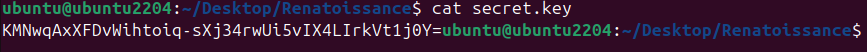
  <br><i>Forensic acquisition of the Base64 encoded Fernet key.</i>
</p>

## Step 2: Restoration Process
The `decrypter.py` script (available in the `/src` directory) was deployed to the affected endpoint. The script performs the following operations:
1. **Key Loading:** Authenticates and loads the `secret.key`.
2. **Reverse Iteration:** Scans for all files with the `.locked` extension.
3. **Decryption:** Decrypts the binary data and overwrites the files with their original, readable content.
4. **Filename Restoration:** Removes the `.locked` suffix to return the files to their original state.

<p align="center">
  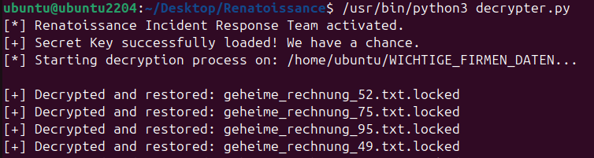
  <br><i>Execution of the Incident Response payload to initiate data recovery.</i>
</p>

## Step 3: Verification & Cleanup
The final stage of the IR process is verifying that the data is intact and removing any remaining artifacts left by the attacker.

<p align="center">
  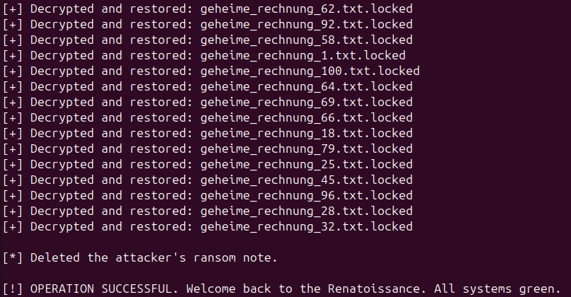
  <br><i>The decrypter confirms the restoration of files and the deletion of the ransom note.</i>
</p>

The system is now fully restored. All 100 dummy files are readable again, and the security breach has been remediated.

---

### Next Steps:
➡️ **[Phase 3: Active Defense & Canary Agent Simulation](#)** *(Work in Progress)*
